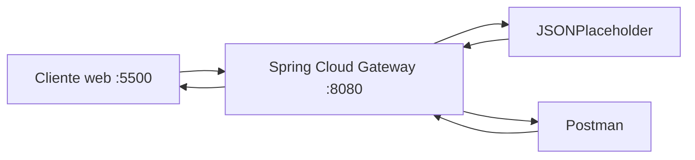

# Evidencias · Laboratorio API Gateway

## Integrantes
- Nombre: Sebastian Pino
- Nombre: Pablo Sepulveda
- Nombre: Bastian Moya

## 1. Backend directo

Antes de utilizar el gateway, registrar las pruebas directas contra JSONPlaceholder.

| Método | URL | Status | Observación |
|---|---|---:|---|
| GET | `https://jsonplaceholder.typicode.com/posts` | | |
| GET | `https://jsonplaceholder.typicode.com/posts/1` | | |

**¿Qué información del backend conoce el cliente en este escenario?**

Respuesta:

"userId",
"id",
"title",
"body"

---

## 2. Arquitectura final



Explicar brevemente qué responsabilidad cumple cada componente.

## Prueba: ruta v1 mediante gateway

**Petición:** GET http://localhost:8080/api/v1/posts/1
**Status:** 200 OK
**Body recibido:** post con id=1, userId=1, title y body de JSONPlaceholder

**Recorrido:**
1. El cliente (PowerShell/iwr) solicita /api/v1/posts/1 al gateway
2. El predicate Path=/api/v1/posts/** hace match
3. El filtro RewritePath transforma /api/v1/posts/1 → /posts/1
4. El gateway reenvía la petición a https://jsonplaceholder.typicode.com/posts/1
5. El backend responde 200 con el JSON del post
6. El gateway retransmite esa respuesta al cliente sin que este conociera la URL real del backend

---

## 3. Pruebas HTTP mediante gateway

| Método | URL | Status | Headers relevantes | Interpretación |
|---|---|---:|---|---|
| GET | `/api/v1/posts` | | | colección |  --> Devuelve todos los elementos
| GET | `/api/v1/posts/1` | | | recurso individual |  --> Devuelve todos los elementos
| POST | `/api/v1/posts` | | | creación simulada |  
| PUT | `/api/v1/posts/1` | | | actualización simulada |
| DELETE | `/api/v1/posts/1` | | | eliminación simulada |

Para POST y PUT incluir también el body enviado.


---

## 4. Routing

- URL solicitada por el cliente: http://localhost:8080/api/v1/posts
- `id` de la route: posts-v1
- predicate que hizo match: /api/v1/posts/**
- URI/integration configurada: https://jsonplaceholder.typicode.com
- path recibido finalmente por el backend: https://jsonplaceholder.typicode.com/posts
- función de `RewritePath`: http://localhost:8080/posts el rewrite path es ocultar la estructura real de la api antes de enviarla al servidor

### Recorrido de una petición

Explicar con sus palabras:

```text
cliente → gateway → backend → gateway → cliente
```

**Recorrido:**
1. El cliente (PowerShell/iwr) solicita /api/v1/posts/1 al gateway
2. El predicate Path=/api/v1/posts/** hace match
3. El filtro RewritePath transforma /api/v1/posts/1 → /posts/1
4. El gateway reenvía la petición a https://jsonplaceholder.typicode.com/posts/1
5. El backend responde 200 con el JSON del post
6. El gateway retransmite esa respuesta al cliente sin que este conociera la URL real del backend

---

## 5. Versionado

- Evidencia `/api/v1`: GET http://localhost:8080/api/v1/posts/1 → 200 OK
- Header `X-API-Version` observado: v1
- Evidencia `/api/v2`: GET http://localhost:8080/api/v2/posts/1 → 200 OK
- Header `X-API-Version` observado: v2

Responder:

1. ¿Por qué mantener v1 y v2 simultáneamente?
    Porque distintos clientes pueden tener versiones diferentes del servicio/producto. Si se apaga la v1 todos quienes estan intentando acceder a ella no podran hacerlo.
2. ¿Qué consumidores podrían seguir usando v1?
    Quienes aun no actualizan el servicio
3. ¿Cuándo retirarían una versión?
    Despues de un periodo de tiempo definido que se da a conocer a los usuarios o cuando el trafico hacia v1 sea mu bajo(Observabilidad/logs)
4. ¿Versionar el contrato público es lo mismo que versionar el servidor desplegado?
    No. Se puede tener dos versiones del contrato publico conectadas al mismo backend, eso evidencia que la versiona del contrato y la version del servidor no son lo mismo 

---

## 6. Header transversal

- Header esperado: `X-Gateway-Lab: DSY1107`
- Evidencia observada: X-Gateway-Lab    DSY1107
- ¿Por qué este comportamiento puede considerarse transversal?: Porque independiente de la version del contrato a la que acceda el header deberia ser el mismo, en este caso `X-Gateway-Lab: DSY1107`. Podriamos que es una evidencia que la peticion entro a gateway

---

## 7. CORS

### Antes de configurar CORS

1. Problema: la petición GET desde el cliente web funcionó incluso antes 
   de configurar CORS en el gateway.
   - Causa: el backend (JSONPlaceholder) ya envía su propio header 
     Access-Control-Allow-Origin de forma reflejada (basado en el header 
     Origin de la petición), y el gateway reenvía los headers del backend 
     sin modificarlos. Por lo tanto, la política CORS "efectiva" que veía 
     el navegador no provenía del gateway, sino del backend.
   - Solución/aprendizaje: para verificar realmente la política CORS del 
     gateway (no la del backend), es necesario un preflight OPTIONS, ya que 
     ese sí requiere que el gateway mismo responda con sus propios headers.

2. Causa: access-control-allow-credentials        true
          access-control-allow-origin             http://127.0.0.1:5500

3. Solucion:
Explicación rápida de cada parte
'[/**]': aplica esta política CORS a todas las rutas del gateway (el patrón /** significa "cualquier path"). Las comillas y corchetes son necesarios en YAML porque /** contiene caracteres especiales.
allowedOrigins: la lista blanca de orígenes autorizados. Aquí solo http://localhost:5500 — nota que es exactamente ese string, sin barra al final, sin 127.0.0.1 (si tu Live Server usa 127.0.0.1:5500 en vez de localhost:5500, vas a necesitar ajustar esto, ¡ya volvemos a eso!).
allowedMethods: qué verbos HTTP autoriza el gateway desde ese origen. Incluye OPTIONS porque el navegador lo necesita para el preflight.
allowedHeaders: "*": por simplicidad en el laboratorio, acepta cualquier header custom que el cliente quiera enviar.

- URL del cliente web: `http://localhost:5500`
- Endpoint consultado: `http://localhost:8080/api/v1/posts/1`
- Resultado visible:
- Mensaje relevante en Console/Network:

### Después de configurar CORS

- Resultado visible: al agregar `globalcors` en el gateway, la petición comenzó a FALLAR con "TypeError: Failed to fetch", aunque el status code HTTP era 200.
- Causa: tanto JSONPlaceholder como el gateway agregaban su propio header 
  Access-Control-Allow-Origin, resultando en el header DUPLICADO en la respuesta final. 
  El navegador considera esto inválido según la especificación CORS y bloquea la respuesta.
- Solución: se agregó el filtro `DedupeResponseHeader` en default-filters, indicando 
  RETAIN_UNIQUE para Access-Control-Allow-Origin y Access-Control-Allow-Credentials.
- `Access-Control-Allow-Origin`: http://localhost:5500 (único, tras la corrección)
- `Access-Control-Allow-Methods`: GET,POST,PUT,DELETE,OPTIONS

### Preflight OPTIONS

- Request utilizado:
    curl.exe -i -X OPTIONS http://localhost:8080/api/v1/posts `
    -H "Origin: http://localhost:5500" `
    -H "Access-Control-Request-Method: POST"
- Status: 200 OK
- Headers relevantes:
    HTTP/1.1 200 OK
    Vary: Origin
    Vary: Access-Control-Request-Method
    Vary: Access-Control-Request-Headers
    Access-Control-Allow-Origin: http://localhost:5500
    Access-Control-Allow-Methods: GET,POST,PUT,DELETE,OPTIONS

Responder:

1. ¿Por qué Postman puede funcionar cuando el navegador falla?
    Porque CORS es una restrticcion que aplica solo a los navegadores, postman no es un navegador
2. ¿Qué es un preflight?
    Una petición OPTIONS que el navegador envía automáticamente antes de la petición real (POST, PUT, DELETE, o GET con headers especiales), preguntándole al servidor si autoriza ese método y esos headers desde ese origen. Solo si la respuesta al preflight es favorable, el navegador envía la petición real.
3. ¿CORS autentica o autoriza usuarios?
    CORS solo controla qué orígenes (dominios) pueden leer la respuesta desde el navegador — no verifica identidad ni permisos de usuario. Eso es trabajo de JWT/OAuth, como hablamos al principio de esta conversación.
4. ¿Qué riesgo tendría permitir cualquier origen sin analizar el contexto?
    Cualquier sitio web (incluso uno malicioso) podría hacer peticiones desde el navegador de un usuario hacia nuestra API y leer las respuestas abriendo la puerta a robo de datos, especialmente si la API maneja información sensible o sesiones autenticadas.

---

## 8. Richardson Maturity Model nivel 2

Explicar qué elementos observados en el laboratorio permiten afirmar que la API utiliza recursos, métodos HTTP y status codes con semántica HTTP.
El nivel dos agrega métodos HTTP, un conjunto estandarizado de verbos que los desarrolladores pueden usar para interactuar con datos y servicios. En muchas configuraciones, los clientes pueden usar cuatro comandos básicos: crear, leer, actualizar o eliminar

La API consumida a través del gateway cumple RMM nivel 2 porque:

1. **Recursos identificables**: cada entidad tiene su propia URL (/api/v1/posts para 
   la colección, /api/v1/posts/{id} para un recurso individual), en vez de un único 
   endpoint genérico que reciba todas las operaciones.

2. **Métodos HTTP con semántica propia**: se probó el mismo recurso /api/v1/posts/1 
   con distintos verbos (GET, PUT, DELETE), y cada uno representó una operación 
   distinta y bien definida — leer, reemplazar, eliminar — sin necesidad de indicar 
   la acción dentro del body.

3. **Status codes significativos**: las respuestas distinguieron 200 (lectura/actualización 
   exitosa) de 201 (creación exitosa), demostrando que el protocolo HTTP se usa con su 
   semántica real y no como un simple transporte genérico.

---

## 9. Responsabilidades

| Responsabilidad | Cliente | Gateway | Backend | Justificación |
|---|:---:|:---:|:---:|---|
| routing | | | | |
| lógica de negocio | | | | |
| autenticación/autorización | | | | |
| transformación de rutas | | | | |
| persistencia | | | | |
| rate limiting | | | | |
| reglas de negocio | | | | |
| observabilidad | | | | |

---

## 10. Problemas encontrados

1. Problema:
   - causa:
   - solución:

---

## 11. Colaboración GitHub

| Integrante | Rama | Pull Request | Aporte principal |
|---|---|---|---|
| | | | |

Agregar enlaces a los Pull Requests.

---

## 12. Conclusiones

- ¿Qué problema resolvió el gateway?
- ¿Qué concepto del laboratorio sería equivalente al trabajar posteriormente con Amazon API Gateway?
- ¿Qué aprendió el grupo que no depende específicamente de Spring Cloud Gateway?
